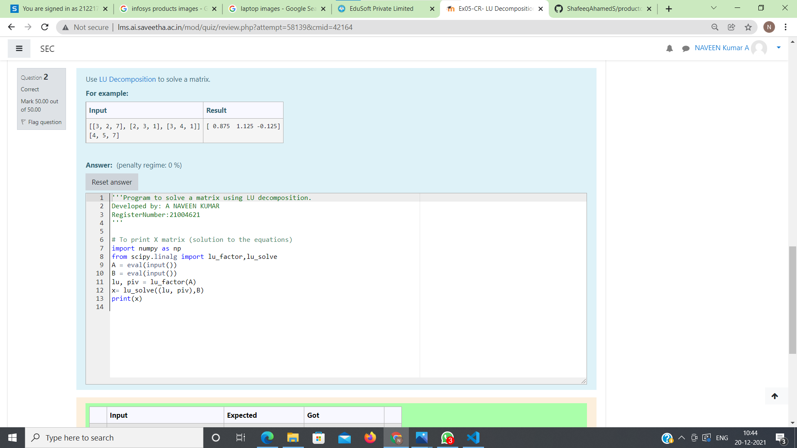
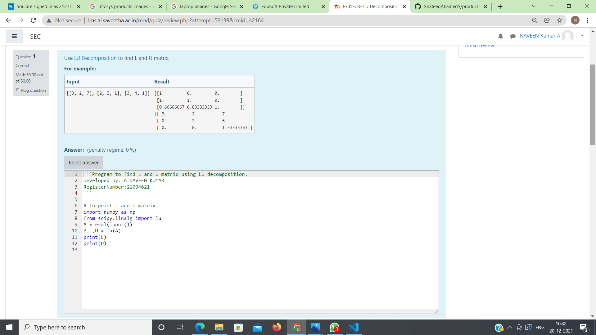

# LU Decomposition without zero on the diagonal

## AIM:
To write a program to find the LU Decomposition of a matrix.

## Equipments Required:
1. Hardware – PCs
2. Anaconda – Python 3.7 Installation / Moodle-Code Runner

## Algorithm
step 1:  start 

step 2:  get an input from the user

step 3:  disply the value for L and U

step 4:  stop
 

## Program:
```
/*
Program to find the LU Decomposition of a matrix.
Developed by:A NAVEEN KUMAR
RegisterNumber:21004621 
*/
import numpy as np
from scipy.linalg import lu
A = eval(input())
P,L,U = lu(A)
print(L)
print(U)

import numpy as np
from scipy.linalg import lu_factor,lu_solve
A = eval(input())
B = eval(input())
lu, piv = lu_factor(A)
x= lu_solve((lu, piv),B)
print(x)
```


## Output:




## Result:
Thus the program to find the LU Decomposition of a matrix is written and verified using python programming.

